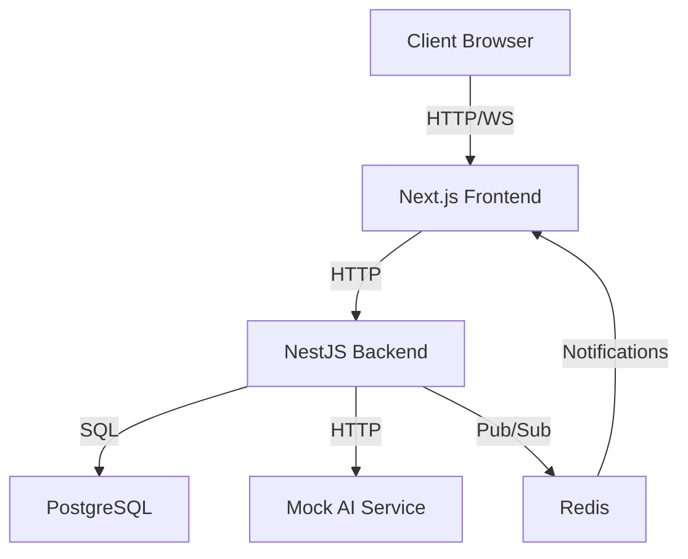

# System Design: Academic Management Platform

## Architecture Overview

- **Type**: Microservices
- **Components**:
  - **Frontend**: Next.js (React) for responsive, role-specific UI
  - **Backend**: NestJS with Prisma for RESTful APIs and WebSocket support
  - **Database**: PostgreSQL for relational data storage
  - **AI Service**: Mocked AI for course recommendations and syllabus generation
  - **Message Broker**: Redis for WebSocket notifications using pub/sub
- **Communication**: HTTP/REST for APIs, WebSockets for real-time updates
- **Authentication**: JWT-based with role-based access control (RBAC)

## Architecture Diagram

